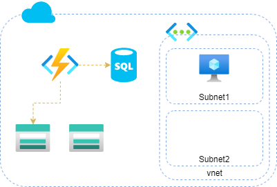
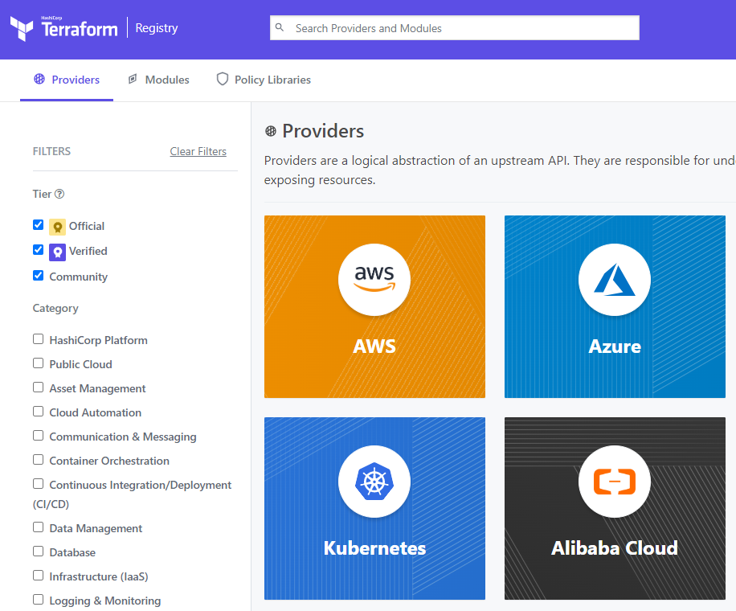

## Taller parte 1 
>
>##### :watch: 120 min

### Objetivo
>
- Instalación terraform
- Creación de estructura de recursos HCL
    -   1 Grupo de recursos
    -   2 Storage
    -   1 function
    -   1 Vnet
    -   2 Subnet
    -   1 SQl Database


>
### Actividades
>
1. Instalación de terraform, seguir instrucciones [link](https://learn.hashicorp.com/tutorials/terraform/install-cli) dependiendo del SO.
>
Si esta trabajando con Ubuntu:
>
```bash
#! /bin/bash
wget -O- https://apt.releases.hashicorp.com/gpg | \
    gpg --dearmor | \
    sudo tee /usr/share/keyrings/hashicorp-archive-keyring.gpg

echo "deb [signed-by=/usr/share/keyrings/hashicorp-archive-keyring.gpg] \
    https://apt.releases.hashicorp.com $(lsb_release -cs) main" | \
    sudo tee /etc/apt/sources.list.d/hashicorp.list

sudo apt update

sudo apt install terraform
```
>
Si esta trabajando con Windows, mediante descarga y configuración de la variable de entorno PATH.
>
```powershell
$PSVersionTable.PSVersion
$path = "c:\temp\"
iwr  https://releases.hashicorp.com/terraform/1.2.8/terraform_1.2.8_windows_amd64.zip -O "$($path)\terraform.zip"
Expand-Archive -LiteralPath "$($path)\terraform.zip" -DestinationPath $path -Force
$env:PATH = $env:PATH + ";" + $path
```
>
1.1. Verificar instalación a traves `terraform version` .
2. Creación folder de trabajo.
3. Crear archivo principal `main.tf`.
4. Seleccionar y aplicar configuracion del proveedor [link](https://registry.terraform.io/browse/providers).

5. Ejecutar en la consola `terraform init` para descargar información del proveedor seleccionado.

> **Nota**: En el siguiente enlace, puede encontrar la relación de los comandos.
>https://www.terraform.io/cdktf/cli-reference/commands
>> - init: https://www.terraform.io/cli/commands/init
>> - plan: https://www.terraform.io/cli/commands/plan
>> - apply: https://www.terraform.io/cli/commands/apply
>> - destroy: https://www.terraform.io/cli/commands/destroy
>> - validate: https://www.terraform.io/cli/commands/validate

6. Aplicar codigo HCL para crear:
    -   1 Grupo de recursos
    -   2 Storage
    -   1 function
    -   1 Vnet
    -   2 Subnet
    -   1 SQL Database

Cada recurso listado previamente tiene una documentación de respaldo dentro de la plataforma de terraform. [Link](https://registry.terraform.io/browse/providers).
>
Ejemplo - [Azure](https://registry.terraform.io/providers/hashicorp/azurerm/latest/docs)  - [AWS](https://registry.terraform.io/providers/hashicorp/aws/latest/docs).



>**Nota** Tener encuentra que en la consola sobre la que esta trabajando, debe haberse logueado previamente a la plataforma en donde se van a desplegar cada uno de los recursos.
>Ejemplo: [Azure](https://registry.terraform.io/providers/hashicorp/azurerm/latest/docs/guides/service_principal_client_secret) [AWS](https://registry.terraform.io/providers/hashicorp/aws/latest/docs#authentication-and-configuration)
>
7. En la medida que vaya creando cada recurso, puede ejecutar `teraform validate` `teraform plan` de manejar que le permita confirmar los cambios realizados.
8. En la configuración de la función, establecer los siguiente valores en las configuraciones:
    - Cadena de conexión del storage account.
    - Cadena de conexión de la base de datos.
9. Para poder organizar el código, por favor crear los archivos `outputs.tf` `providers.tf` `variables.tf`, `terraform.tfvars`
10. Separar el código del archivo `main.tf` y distribuirlo en los archivos según corresponda, dado los creados previamente.
    Ejemplo:
    - main.tf: información de los resource o data-resources
    ```bash
    resource "azurerm_resource_group" "rg2" {
        name     = "build-rg"
        location = "eastus"
    }
    ```
    - variables.tf: declaración de variables
    ```bash
    variable "string" {
        type        = string
        description = "(optional) describe your variable"
    }
    locals{
        ....
    }
    ```
    - providers.tf: estructura general de terraform e información de proveedores
    ```bash
    terraform {
        required_providers {
          ...
        }

        provider "azurerm" {
        ...
        }
    }
    ```
    - terraform.tfvars: definición de variables
    ```bash
    name="example_dev"
    tags = {
        env="dev"
        by="example-1"
    }
    ```
11. Ejecutar el comando `terraform fmt` para ajustar el código.
12. Ejecutar `terraform validate` y `terraform plan`, para confirmar estructura y generar plan de ejecución de los recursos que van a ser desplegados.
13. En el momento que lo decida, puede aplicar `terraform apply` para desplegar sus cambios al entorno deseado.