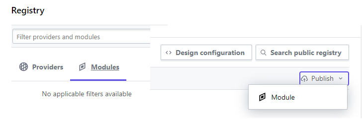
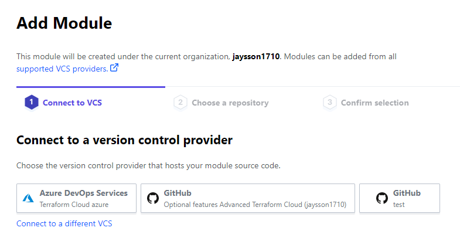

## Taller parte 6
>
> :watch: 60 min
>
### Objetivo
>
- Publicación y uso de modulos.
>
### Actividades
>
De los modulos generados previamente en el taller, aplicar el manejo de módulos remotos a traves de tags en el repositorio de codigo.
Para el ejercicio se debe tener acceso a una herramienta de administracion de codigo (público o privado).

### Publicación en repositorio
>
1. Generar repositorio con el nombre  terraform-{proveedor}-{objetivo}
2. Cargar el código de uno de los modulos en el nuevo repositorio.
3. Generar tag en el repositorio con la convesion `vX.X.X`, ejemplo `v1.0.1`
4. En el proyecto de teraform remover el modulo que fue migrado.
5. En el archivo principal cambiar la referencia al modulo migrado por 
    ```json
    module "remoto_github" {
      source="git::{url repo}?ref={tag}"
    ```
6. Aplicar comando `terraform init`, para descargar información del módulo.
7. Validar y aplicar cambios.
8. Confirmar que los registros a crear pertenecientes al modulo fueron ejecutados correctamente.
>
### Publicacion en terraform Cloud
>
En el siguiente enlace encuentra la documentación para la publicación de los modulos en un registry privado [Link](https://www.terraform.io/cloud-docs/registry/publish-modules)
>
1. Ingresar a la plataforma de terraform https://app.terraform.io/ (registrarse).
2. En el menú superior seleccionar la opcion registry.
3. Seleccionar la opción modulos y posteriormente publicar.
>

>
4. Seleccionar la opcion *Connect to a different VCS*.
5. Seleccionar la plataforma sobre la que esta qel codigo del modulo creado (parte anterior del taller).
6. Seguir los pasos del registro, para permitir que terraform tenga acceso al repositorio de código.
  - Confirmar sobre plataforma del repositorio
7. Repetir los pasos dos y tres.
8. Seleccionar la conexion creada

9. Seleccionar el repositorio que tiene el código del módulo y publicar
10. En el archivo principal del proyecto, adicionar un llamado al modulo publicado.
11. Generar un token sobre la plataforma de terraform cloud 
  - Menu principal settings
  - Seccion security / API Tokens
  - Seguir los pasos de la plataforma para crear un token de usuario
12. Crear un archivo llamado *terraform.rc* para Windows o *terraformrc* para Linux y plasmar alli  el token obtenido.
  - El archivo debe contener la siguiente estructura
    ```
      credentials "app.terraform.io" {
      token = "xxxxxxxxxxxxxxx"
    }
    ```
13. Ubicar el archivo en la ruta especifica dependiendo del SO:
  - Windows: $env:APPDATA\
  - Linux: ~/
14. Validar y aplicar.
15. Confirmar la creación de los recursos manejados por el módulo recien creado.
